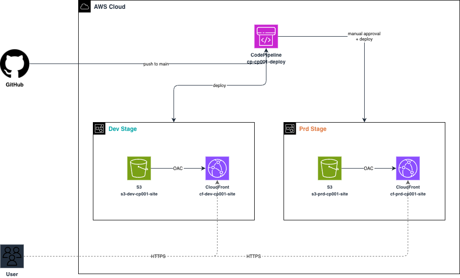

# cdk-pipeline-001

S3 + CloudFront の静的サイトを CDK Pipelines で dev/prd にデプロイする。

## 構成図



---

## セットアップ

### CDK Bootstrap

AWS CloudShell を開いて以下を実行する。

```bash
export ACCOUNT_ID=$(aws sts get-caller-identity --query Account --output text)
export REGION=ap-northeast-1

npx cdk bootstrap aws://${ACCOUNT_ID}/${REGION}
```

### CodeConnection の作成

[cfn/README.md - codeconnection](./cfn/README.md#codeconnectionyaml) を参照。

### Hosted Zone の作成

[cfn/README.md - hostedzone](./cfn/README.md#hostedzoneyaml) を参照。

### Pipeline の初回デプロイ

初回のみ手動で Pipeline スタックをデプロイする必要がある。以降は GitHub への push で自動実行される。

zip を作成し、CloudShell にアップロードして実行する。

```bash
unzip cdk.zip
cd cdk
npm ci
npx cdk deploy
```

### GitHub に push して Pipeline デプロイ

[cdk/README.md](./cdk/README.md) を参照。
